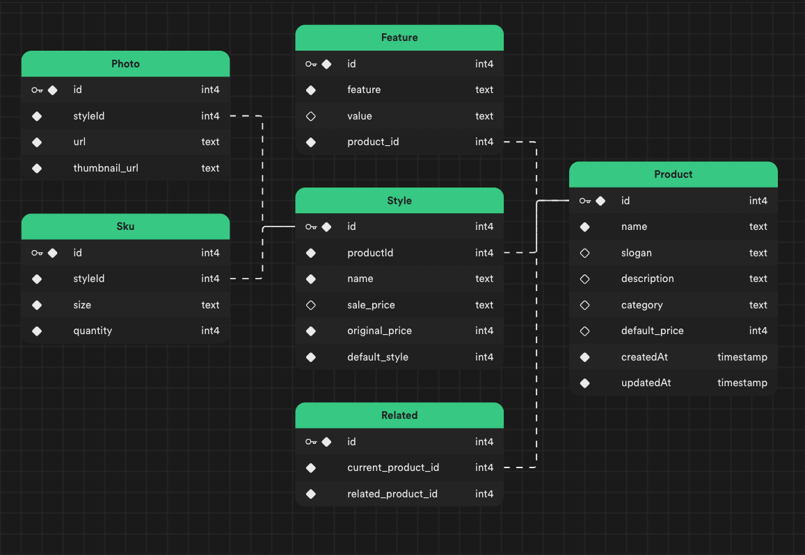
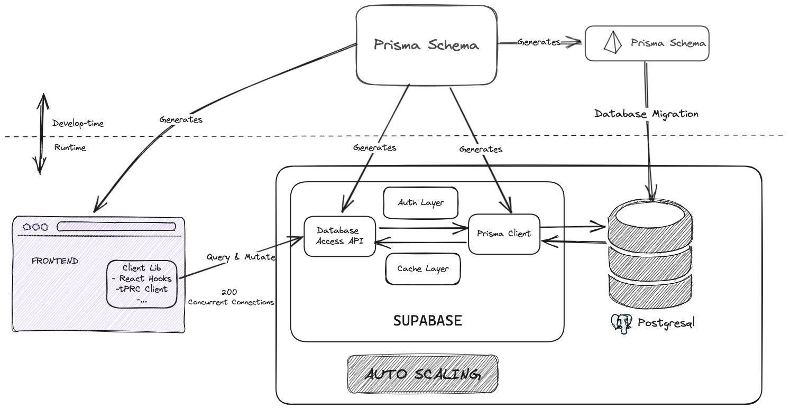

# Cadmus Project

Welcome to the Cadmus project repository! Here, you'll find the source code and comprehensive documentation for the Cadmus project. This repository serves as the foundation for the Cadmus project, which offers a robust API tailored for an ecommerce website.

## Table of Contents

- [Schema Design](#schema-design)
- [System Architecture](#system-architecture)
- [Tech Stack](#tech-stack)
- [Installation](#installation-and-running)
- [API Endpoints](#api-endpoints)

## Schema Design

The Cadmus project utilizes a well-designed database schema to efficiently store and manage data. The schema includes tables for products, features, styles, skus, photos, and more. The schema design ensures data integrity and supports complex relationships between entities.



## System Architecture

Cadmus follows a modular and scalable system architecture. It is built using Express.js for the backend, utilizing RESTful API endpoints for data retrieval and manipulation. The Prisma ORM is used for database interactions, ensuring reliable and efficient data handling. The frontend, if available, can be built using any modern web framework such as React or Vue.js.



## Tech Stack

<div align="center">
  
  
  
  
  
</div>

- Express.js: Express.js was chosen for its simplicity and flexibility in building web applications and APIs. It provides a solid foundation for routing, middleware handling, and request/response management.

- Prisma: Prisma serves as the ORM (Object-Relational Mapping) for interacting with the PostgreSQL database. Its modern query building capabilities, type safety, and schema management streamline database operations while maintaining code readability.

- Supabase: Supabase brings a layer of authentication and data management to the project. Its authentication features enhance security by providing secure access control and user management. Additionally, its real-time capabilities open up possibilities for dynamic and interactive applications.

- Node.js: Node.js serves as the runtime environment, offering a non-blocking, event-driven architecture that facilitates handling concurrent connections efficiently.

- PostgreSQL: PostgreSQL was chosen as the database management system due to its reliability, ACID compliance, and support for complex queries. It aligns well with the Prisma ORM and offers scalability for future growth.


## Installation and Running

**PREREQUISITE**: Follow the guide in supabase to create an account and retrieve the necesary credentials in order to populate the ``env`` file (May only need the DATABASE_URL). [SET UP](https://supabase.com/partners/integrations/prisma)

To get started with Cadmus, follow these steps:

1. **Clone the repository:**

   ```bash
   git clone https://github.com/your-username/cadmus.git
   ```

2. **Install dependencies**

    ```bash
    npm install
    ```
3. **Migrate/Create Tables**


    ```bash
    npm run migrate:dev
    ```

4. **Seed Tables**


    ```bash
    npm run seed
    ```

## API Endpoints

**Request:**

  ```http
  GET /products
  GET /products/:productId
  GET /products/:productId/styles
  ```